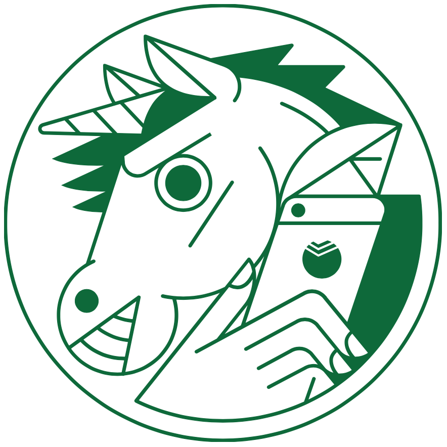
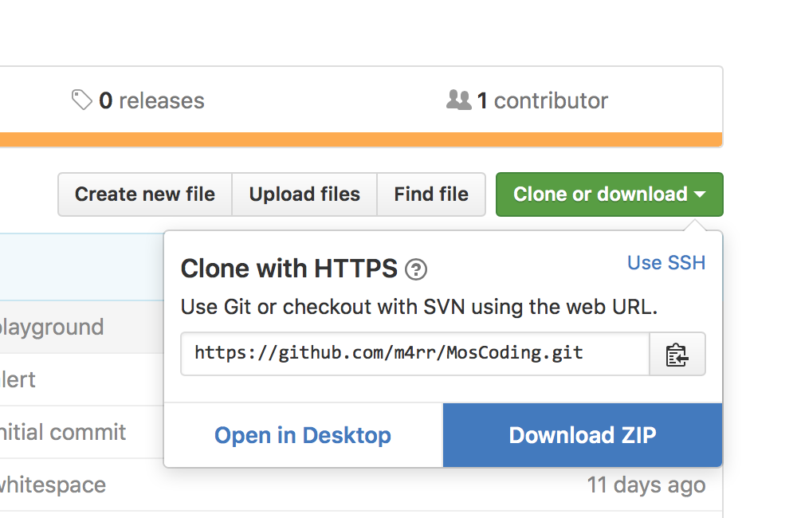

# Курс разработки iOS-приложений

Подробнее о курсе: [moscoding.ru/swift](http://moscoding.ru/swift/)

 

## Как пользоваться [репозиторием](https://ru.wikipedia.org/wiki/Репозиторий)

Больше информации по каждому дню курса в разделе [Issues](https://github.com/m4rr/MosCoding/issues).

Больше кода — здесь, в разделе [Code](https://github.com/m4rr/MosCoding).

Замечания и исправления можно присылать, и смотреть в разделе [Pull requests](https://github.com/m4rr/MosCoding/pulls).

Скачать этот репозиторий [по ссылке](https://github.com/m4rr/MosCoding/archive/master.zip) или вот так:

